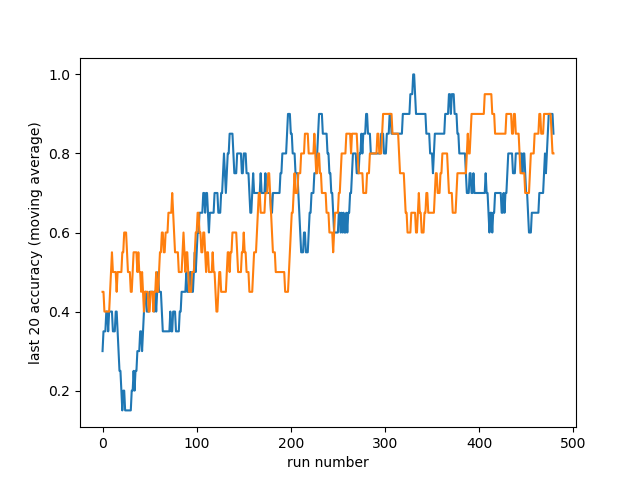
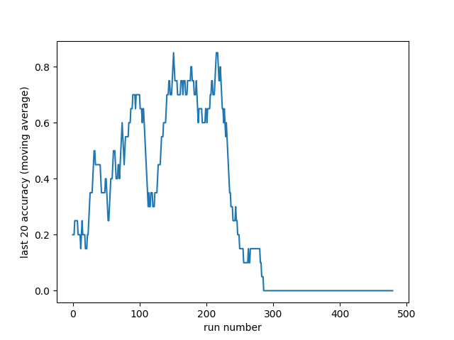

# Reinforcement-Learning-Exercises

Reinforcement learning agents in discrete continuous state spaces are being implemented.
The following project contains :  

- A Reinforcement learning agent using Expected Sarsa with a memory and an action-value function represented by a neural network (continuous state spaces, discrete action space)  
- A Reinforcement learning agent using a policy gradient method : the Gaussian actor-critic(continuous state spaces, continuous action space)  
- A failed attempt to add curiosity to the first Sarsa agent  
- Some simple test environments. The Sarsa agent was also tested on the Cartpole and the Mountain Car gym environments.  

The general principles governing the first two agents as well as the equations can be found in Reinforcement Learning : An Introduction.  

I think I shouldn't be embarrassed that 20-year-old-me wasn't successful in every little machine learning project he attempted, and I therefore left them here. Please keep in mind they don't reflect my current level of expertise if you read that after 2020.

### Results in discrete action spaces  

The first agent (Sarsa with a neural network) using a feature vector equal to the continuous state parameters given by the environment (without reward modification) performs well on the cartpole problem and solves it in around 30 episodes.  

It would require the agent far more random exploration to succeed in the Moutain Car environment, and the computing power at my disposal doesn't allow me to run hundreds of episodes. I attempted to make the agent find the winning state faster by adding curiosity, but it didn't work (see the last paragraph).  

### Results in continuous action spaces

I implemented the Gaussian actor-critic algorithm quickly outlined in Reinforcement Learning : An Introduction. I tested the agent on a simple 1D environment in which the agent controls the thrust of the rocket to make it land.  
The default option solves the problem most of the time, making the agent make the rocket land successfully about 80% of the time (the default parameters given make it land only 40% of the time). These results aren't great, but given the simplicity of the model (mu is proportional to the rocket's speed an position, and so does log(sigma)), it isn't that surprising.  

  

More surprising is that adding a bias doesn't improve the results, and sometimes make the learning unstable: after a few hundreds of epsiodes, it gets stuck in a loop of "I'm not sure what to do" after a few unexpected fails, then increases sigma, fails to land even more, gets even more unsure on what to do, ... and the loop continues, making successful landings impossible. I'm not sure why it does that when I add a bias. Further investigation would be needed. I attempted to solve the issue by clipping the gradient and the thrust, but it doesn't solve the issue.  

  

I also implemented the same algorithm with tensorflow.keras using tensorflow's GradientTape, in order to make the pi function more complex, but it also seems to add instability.  

### Attempt at adding curiosity to an agent in a continuous state space  

In Dyna-Q+, exploration is encouraged by adding a reward which depends on the last time a state was explored. That can't be done for continuous action spaces, but I attempted to do so by adding a reward proportional to how far the agent was to the k-closest states in memory (with k = 10 and a memory of 512). I noticed it required a lot of manual fine tunning for the reward to be in the good order of magnitude, and in the end it didn't produced good results in the short time window I could give to the agent. One main issue was that the agent wasn't able to tell near which state he visited a lot were the states he didn't.
